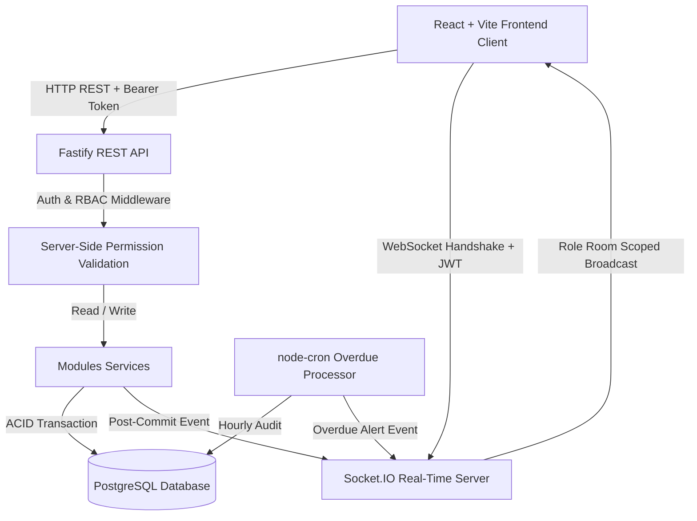
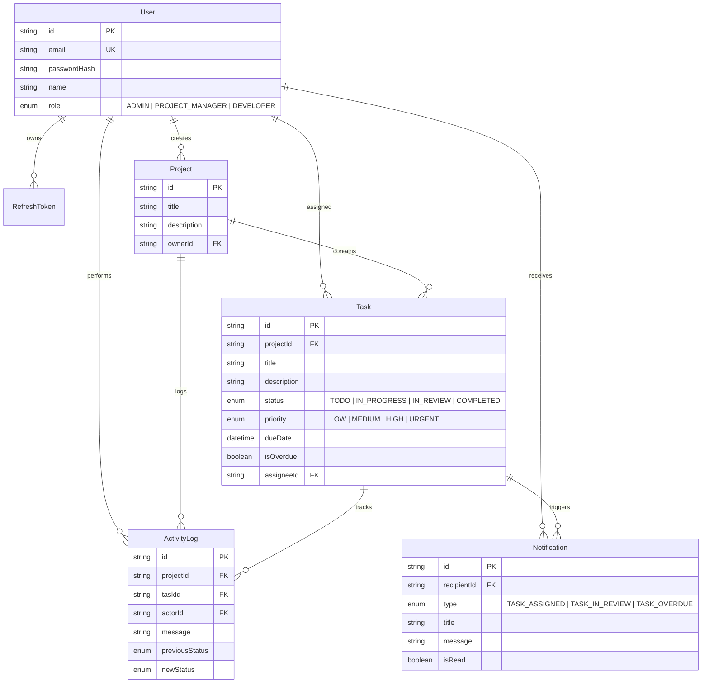

# Real-Time Client Project Dashboard (AgencyFlow)

> A production-quality, role-scoped, real-time project management dashboard built with Fastify, PostgreSQL, Prisma, Socket.IO, node-cron, and React.

---

## 1. Project Overview & Problem Statement

Small agencies managing multiple clients and projects need a lightweight internal dashboard where **Admins**, **Project Managers**, and **Developers** can collaborate without exposing unauthorized project or task information.

Generic project management tools (Trello, Asana) either over-expose data across roles or require heavy, error-prone manual configuration. **AgencyFlow** enforces strict API-level role-based data isolation, streaming every task status change in real time via Socket.IO only to authorized eyes, while automatically flagging overdue tasks with background scheduled jobs.

---

## 2. Mandatory Architectural Highlights & Key Features

* **Strict API-Level RBAC & Data Isolation**:
  * **Developers**: Can only access tasks assigned to them (`assigneeId == user.id`). Cannot view other developers' tasks or modify task ownership.
  * **Project Managers**: Can manage only projects they created (`ownerId == user.id`). Cannot access other PMs' projects via modified URLs, bodies, or headers.
  * **Admins**: Global oversight across all users, projects, tasks, global activity streams, and live online user presence counts.
* **Real-Time Activity Feed (Socket.IO)**:
  * Transaction-hooked event emission (events are emitted *only after* PostgreSQL `$transaction` commits).
  * Role-aware room strategy (`room:admin`, `room:project:{id}`, `room:user:{id}`).
  * Live user presence tracking.
* **Database-Backed Missed-Event Recovery**:
  * On reconnection, clients fetch the last 20 role-filtered activity events directly from PostgreSQL via `GET /api/activity/catchup`.
* **Automated Overdue Task Job (`node-cron`)**:
  * Hourly cron job identifying tasks whose due date has passed without completion.
  * Updates `isOverdue: true` idempotently and creates DB activity logs and notifications without duplicate spam.
* **Shareable Filter URLs**:
  * Task filters (`status`, `priority`, `overdueOnly`) are processed server-side and reflected directly in URL query parameters (`/tasks?status=IN_PROGRESS&priority=HIGH`).

---

## 3. Technology Stack & Architectural Justifications

| Layer | Technology | Architectural Justification |
|---|---|---|
| **Backend** | **Node.js + Fastify + TypeScript** | Chosen over Express for lower HTTP overhead, superior throughput, and native schema validation integration via Zod. |
| **Database** | **PostgreSQL** | Relational integrity, ACID transaction guarantees, and indexed foreign keys (`projectId`, `assigneeId`, `status`, `dueDate`, `isOverdue`). |
| **ORM** | **Prisma ORM** | Provides type-safe queries, migration control, schema-as-code, and `$transaction` safety. |
| **Real-Time** | **Socket.IO** | Chosen over native WebSockets for built-in auto-reconnection, heartbeat presence tracking, and clean room-based role broadcasting. |
| **Background Jobs** | **node-cron** | Lightweight and predictable for single-server hourly overdue task processing without adding a heavy Redis dependency. |
| **Auth** | **JWT + HttpOnly Cookie** | Short-lived JWT access token in memory/headers + HttpOnly refresh token cookie with automatic token rotation. |
| **Frontend** | **React + Vite + TS + Tailwind + shadcn/ui** | Fast Vite HMR, TanStack Query server-state caching, and clean dark-mode UI. |

---

## 4. Architecture & Data Flow Diagram



---

## 5. Database Schema Diagram



---

## 6. Seed Data & Local Test Credentials

The database seed script initializes real ownership boundaries across PMs and Developers:

* **Password for ALL accounts**: `Password123!`

| Role | Name | Email | Scoped Data |
|---|---|---|---|
| **ADMIN** | Amara Admin | `admin@agency.com` | Global visibility across all users, projects, tasks, and live online count |
| **PROJECT_MANAGER** | Ravi Manager (Alpha) | `pm1@agency.com` | Owns "E-Commerce Re-platforming" & "Mobile App Redesign" |
| **PROJECT_MANAGER** | Sarah Manager (Beta) | `pm2@agency.com` | Owns "Cloud Infrastructure Migration" |
| **DEVELOPER** | Divya Dev | `dev1@agency.com` | Assigned tasks in E-Commerce project |
| **DEVELOPER** | Alex Dev | `dev2@agency.com` | Assigned tasks in E-Commerce & Mobile projects |
| **DEVELOPER** | Chen Dev | `dev3@agency.com` | Assigned tasks in Mobile & Cloud projects |
| **DEVELOPER** | Elena Dev | `dev4@agency.com` | Assigned tasks in Cloud Infrastructure project |

---

## 7. Setup & Development Instructions

### Prerequisites
* **Node.js**: v18+ or v20+
* **PostgreSQL**: Local service or Docker container

### Step 1: Environment Setup
Copy `.env.example` to `.env` in both root and `backend/`:
```bash
cp .env.example .env
cp .env.example backend/.env
```

### Step 2: Database Migration & Seeding
In `backend/` directory:
```bash
cd backend
npm install
npx prisma db push
npm run prisma:seed
```

### Step 3: Run Backend Server
```bash
npm run dev
# Fastify REST API running on http://localhost:5000
```

### Step 4: Run Frontend Client
In `frontend/` directory (open separate terminal):
```bash
cd frontend
npm install
npm run dev
# Vite React app running on http://localhost:5173
```

---

## 8. Socket.IO Room & Event Strategy

| Room Pattern | Members | Events Sent |
|---|---|---|
| `room:admin` | Admin Users | `activity:created`, `presence:update` |
| `room:project:{id}` | PM (Owner) + Assigned Developers | `activity:created`, `task:updated` |
| `room:user:{id}` | Individual User | `notification:new`, `task:updated` |

---

## 9. Automated Testing

Run backend security and RBAC isolation test suite:
```bash
cd backend
npm test
```
The test suite verifies:
* Direct API RBAC protection (rejecting unauthorized PM/Dev access with `403 Forbidden`).
* Token tampering rejection (`401 Unauthorized`).
* HttpOnly refresh cookie issuance & rotation.

---

## 10. 60–90 Second Demonstration Flow Guide

1. **Log in as PM 1 (`pm1@agency.com`)**:
   * Show PM Dashboard. Observe only "E-Commerce" and "Mobile App" projects are visible.
2. **Open Window 2 & Log in as Developer 1 (`dev1@agency.com`)**:
   * Show Developer Dashboard. Observe only assigned tasks are visible.
3. **Trigger Real-Time Activity**:
   * In Dev 1's window, move task status from `TODO` -> `IN_PROGRESS` -> `IN_REVIEW`.
   * **Judges observe PM 1's window update live via Socket.IO without page refresh.**
4. **Log in as Admin (`admin@agency.com`) in Window 3**:
   * Show global activity feed receiving the same status change.
   * Observe live **3 Users Online** presence badge.
5. **Verify API RBAC Protection**:
   * Attempt to fetch PM 1's project using Dev 1's token in Postman/Curl (`GET /api/projects/:pm1_id`).
   * Observe **403 Forbidden** response, proving server-side enforcement.
